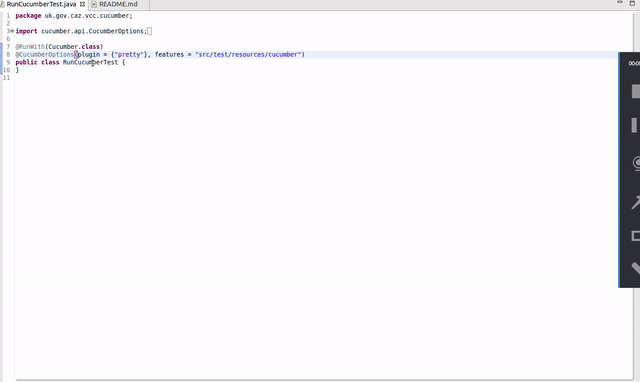

# JAQU-CAZ Vehicle Compliance Checker API

## First steps in Vehile Compliance Checker

### Prerequisites

* Java 8
* aws-cli (for deployment).
See official [AWS Guide](https://docs.aws.amazon.com/cli/latest/userguide/cli-chap-install.html)
for instructions.
* aws-sam-cli (for testing locally). See official [AWS Guide](https://docs.aws.amazon.com/serverless-application-model/latest/developerguide/serverless-sam-cli-install.html)
for instructions.
* Docker (for testing using mocks from Localstack and for aws-sam)

### Configuring code style formatter
There are style guides for _Eclipse_ and _Intellij IDEA_ located in `developer-resources`.
It is mandatory to import them and format code to match this configuration. Check Eclipse or IDEA
documentation for details how to set this up and format code that you work on.

### Adding and configuring Lombok
What is [Lombok](https://projectlombok.org/)?

*Project Lombok is a java library that automatically plugs into your editor and build tools, spicing up your java. Never write another getter or equals method again, with one annotation your class has a fully featured builder, Automate your logging variables, and much more.*

Lombok needs to be installed into Maven build process and into _Eclipse_ and _Intellij IDEA_.
1. Lombok and Maven - this is already configured in _pom.xml_ - nothing more to do.
2. Eclipse - follow up this [official tutorial](https://projectlombok.org/setup/eclipse) to install into Eclipse.
2. IDEA - follow up this [official tutorial](https://projectlombok.org/setup/intellij) to install into IDEA.

For more details about what Lombok can do see this [feature list](https://projectlombok.org/features/all).

## Adding and configuring Cucumber
What is [Cucumber](https://cucumber.io/docs/guides/overview/)?

*Cucumber is a tool that supports Behaviour-Driven Development (BDD).*

A large number of the project's unit tests are written in Cucumber tests, for ease of readability and debugging.

Running these tests within Eclipse (the editor of choice for the project) requires installation of an additional plugin - see [this StackOverflow answer](https://stackoverflow.com/questions/42399721/run-as-cucumber-feature-not-showing-in-eclipse#answer-42403932) for guidance on setting this up.

Once installed, right-clicking on a `.feature` file will offer a 'Run/Debug as Cucumber Feature', much like the Junit equiavlent. This will run that individual `.feature` file.

To run/debug tests, right-click on the `RunCucumberTest` class (inside the `test/java/.../cucumber/` folder) and select 'Run/Debug as Junit test'. Make sure that the test runner is set to Junit 4.



### Configuring Nexus access
What is [Nexus](https://www.sonatype.com/nexus-repository-sonatype)?

*Nexus manages components, build artifacts, and release candidates in one central location.* We 
use it as repository for our internal artifacts but also as a proxy for Maven central repo - so as a cache
speeding up our builds.

You need to configure access to JAQU Nexus instance because without it you won't be able to build
and deploy artifacts and projects.

Firstly you need to obtain 3 values:
1. Nexus URL
2. Nexus username
3. Nexus password

You can ask a fellow developer or dedicated DevOps team for these values. Now you need to copy 
`settings.ci.xml.template` from `ci-cd-resources` directory to your local Maven repo dir: `~/.m2/`.
Then backup any existing `~/.m2/settings.xml` file and either copy contents of `settings.ci.xml.template` into
`settings.xml` or rename `settings.ci.xml.template` to `settings.xml`.

Now you need to set Nexus data.
You can either set 3 environment variables:
1. `export JAQU_NEXUS_URL=<nexus url>`
1. `export JAQU_NEXUS_USER=<nexus user>`
1. `export JAQU_NEXUS_PASSWORD=<nexus password>`

or:

Replace `${env.JAQU_NEXUS_URL}`, `${env.JAQU_NEXUS_USER}` and `${env.JAQU_NEXUS_PASSWORD}` strings in
`settings.xml` to the values you got from colleague or DevOps team.

### AWS setup
As this service integrates with AWS Secrets manager, you will need to configure your ~/.aws settings appropriately. In the ~/.aws/config file, a default region must be set as per the below:

```
[default]
region = eu-west-2
```

Credentials must also be setup under a profile named 'dev' which is applied as the active profile on Spring starting up (see application.yml). In the ~/.aws/credentials file, this requires a profile to be present as per the below:

```
[dev]
aws_access_key_id = ************
aws_secret_access_key = *************
```


### Vagrant
Optionally you can use Virtual Machine to compile and test project.
A Vagrant development machine definition inclusive of the following software assets can be found at the root of this repository:

1. Ubuntu 18.04 LTS
1. Eclipse for Java Enterprise
1. OpenJDK 8
1. Maven
1. Git
1. Docker CE (for backing tools used for example to emulate AWS lambda functions and DB instances)

As a complimentary note, this Vagrant image targets VirtualBox as its provider. As such, the necessary technical dependencies installed on the host are simply VirtualBox and Vagrant.

### Commit hooks

To minimize the risk of making a _broken_ commit you may want to enable a git pre-commit hook which 
builds the project before a change is committed. Please execute the following in the root project 
directory:
```
$ developer-resources/scripts/git-hooks/install-pre-commit-hook.sh
```
This will create a symlink to `developer-resources/scripts/git-hooks/pre-commit-hook.sh`. If 
the symlink exists or there is another `pre-commit` file in `.git/hooks` directory, the script does 
nothing and appropriate error message is displayed.

If you want to disable the hook please use `--no-verify` option for `git commit`.

## Local Development: building, running and testing

[Detailed descripton of how to build, run and test VCC service](RUNNING_AND_TESTING.md)

## (dev) Deployment

The following command will build, pack and deploy the service as a artifact used by AWS Lambda
and API Gateway.

```
$ make build deploy-to-aws S3_BUCKET_NAME=name_of_your_bucket STACK_NAME=name_of_your_stack
```

To only deploy:

```
$ make deploy-to-aws S3_BUCKET_NAME=name_of_your_bucket STACK_NAME=name_of_your_stack
```

## Database management

Liquibase is being used as database migrations tool.
Please check `src/main/resources/db.changelog` directory. It contains file named `db.changelog-master.yaml`
which is automatically picked up by Spring Boot at application startup. This file drives
application of all changesets and migrations.

### Liquibase naming convention
Each changeset should be prefixed with consecutive 4-digit number left padded with zeros.
For example: 0001, 0002, 0003. Then current application version should be put and finally some
short description of change. For example:

`0001-1.0-create_tables_abc.yaml`

What we see is application order number, at what application version change was made and finally
a short description of changes. Pretty informative and clean.

If one changeset file contains more than one change, please put consecutive numbers in changeset id:

`0002.1`, `0002.2` and so on.

Raw SQL files must be used from Liquibase Yaml changesets and put into `rawSql` subfolder.
Please use existing files as an example.

## API specification

API specification is available at `{server.host}:{server.port}/v1/swagger-docs` (locally usually at http://localhost:8080/v1/swagger-docs)

A Swagger UI is available `{server.host}:{server.port}/swagger-ui.html` (locally usually at http://localhost:8080/swagger-ui.html)


## Validation rules for vehicle entrants

### API payload validation rules

| Rule description                          | Trigger | Error message                                                                                                               |
|-------------------------------------------|---------|-----------------------------------------------------------------------------------------------------------------------------| 
| Missing VRM field                   | API     | ```{"errors":["Vehicle index: 0; reason: Mandatory field missing; details: vrn"]}```                             
 | Empty VRM field                   | API     | ```{"errors":["Vehicle index: 0; reason: Mandatory field empty; details: vrn"]}```                              |
 | Invalid VRM format                   | API     | ```{"errors":["Vehicle index: 0; reason: Invalid field value; details: vrn:SW61BYDDDDDDD"]}```                            
 | Missing timestamp field                   | API     | ```{"errors":["Vehicle index: 0; reason: Mandatory field missing; details: timestamp"]}```                             
 | Empty timestamp field                   | API     | ```{"errors":["Vehicle index: 0; reason: Mandatory field empty; details: timestamp"]}```                              |
 | Invalid timestamp format                   | API     | ```{"errors":["Vehicle index: 0; reason: Invalid field value; details: timestamp:2019-10-10"]}```                            

### Validation rules applicable only to API

| Rule description                          | Trigger | Error message                                                                                                               |
|-------------------------------------------|---------|-----------------------------------------------------------------------------------------------------------------------------| 
| Missing request payload                                | API     | ```No response, 400 HTTP status returned```                                                                                         |
| Empty JSON payload ('{}')                              | API     | ```{"status":400,"message":"List of vehicle entrants cannot not be null."}```                                                                                                 |
| Missing Content-type header                            | API     | ```No response, 415 HTTP status returned```                            |
| Unsupported Content-type header                        | API     | ```No response, 415 HTTP status returned```|
| Wrong HTTP method                                      | API     | ```No response, 405 HTTP status returned```                      | 
| Missing 'X-Correlation-ID' header                      | API     | ```{"status":400,"message":"Missing request header 'X-Correlation-ID'"}```                                 | 
| Missing 'x-api-key' header                             | API     | ```Missing request header 'x-api-key' for method parameter of type String```                                                                                                                      | 


### Logging strategy

A logging strategy is employed to ensure traceability throughout the application logs. Logs must be taken:

- Prior to any attempt in connecting to an external API. This includes other components of the CCAZ system. Verbosity level: `INFO`
- Post any attempt in connecting to an external API. This includes succcessful requests. Verbosity level: `INFO`, if successful; `ERROR`, if not.
- When checked exceptions are caught. Verbosity level: `ERROR`

The logs must contain a means of identifying the request - usually X-Correlation-ID.
